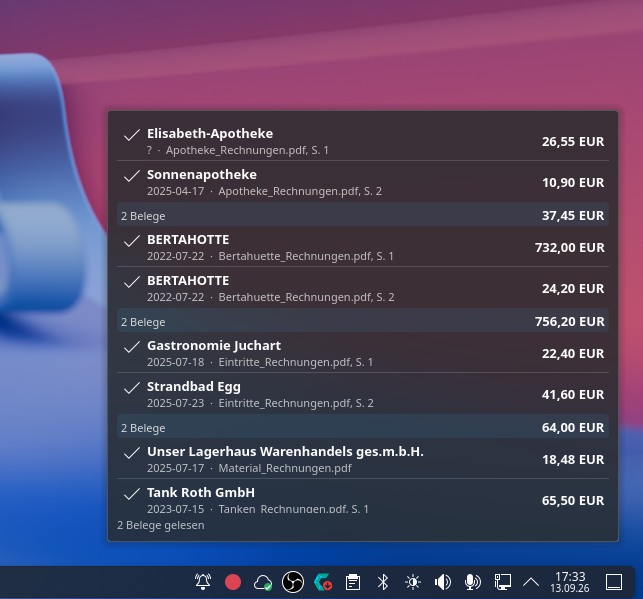

# InvoiceDrop

Read invoices and receipts from PDF, JPEG and PNG files with a local AI model,
and report the shop, the date and the sum on one line.

```
$ invoicedrop bill1.pdf
bill1.pdf  Unser Lagerhaus Warenhandels ges.m.b.H.  2025-07-17  18,48 EUR
```



Everything runs on your machine: inference goes to a local
[Ollama](https://ollama.com) instance, text extraction and rasterising use MuPDF,
Leptonica and Tesseract. No document and no field ever leaves the machine.
**Vibecoded** — written in a chat by a model, see [below](#vibecoded). Every phase
in `docs/plan.md` is finished; the `bills` suite is red, failing on the model's
reading rather than on the code's.

## Install

CachyOS or Arch, Ollama, a model that reports `vision`, and these packages:

```fish
sudo pacman -S --needed base-devel cmake ninja pkgconf \
    qt6-base libmupdf leptonica tesseract tesseract-data-deu tesseract-data-eng
ollama pull gemma4:latest

cmake -B build-local -G Ninja -DCMAKE_BUILD_TYPE=Release \
    -DCMAKE_INSTALL_PREFIX="$HOME/.local"
cmake --build build-local; and cmake --install build-local
invoicedrop doctor         # what works, and how to fix what does not
```

Package: `makepkg -si` from inside `packaging/`. System-wide: `sudo cmake --install`.

## Use

```fish
invoicedrop rechnung.pdf ~/scans/*.jpg   # one line per bill
invoicedrop --json rechnung.pdf | jq .gross_total
invoicedrop history                      # what is stored, newest first
invoicedrop daemon                       # watch the inbox, announce arrivals
```

A bill is a page, not a file: a two page scan prints two lines, labelled
`file.pdf:2`, and a file with more than one bill is added up underneath them.

Everything else is in [docs/reference.md](docs/reference.md): options, JSON
fields, exit codes, the daemon, the widget, the model comparison, the project
layout, troubleshooting. Inside: [docs/architecture.md](docs/architecture.md).

## Vibecoded

This project was written in a chat, not by hand. The code, the tests and this
document were produced by **DeepSeek V4 Flash**, through GitHub Copilot in VS Code
1.137.0 on CachyOS, over the 10th and 11th of September 2026. The model was
reached through the `vizards.deepseek-v4-for-copilot` extension, version 0.8.2.
The requirements, the real invoices, the hardware and every decision along the way
came from a human, who ran the result and judged it.

That is worth knowing before reading the rest, because it changes what this prose
is evidence of. Three rules were followed while writing:

* **A claim that says "measured" was measured.** The default for `--think`, the
  choice of `gemma4:latest` over `minicpm-v:8b`, the decision to leave OCR off, the
  quality warning threshold — each of those came from running the thing against
  the documents in `tests/testdata/` and writing down what came out.
* **What could not be checked says so.** `makepkg` inside a clean chroot, for one,
  has not been run, and `docs/plan.md` says that rather than implying it works.
* **Each phase records what it got wrong.** The interesting parts of
  `docs/plan.md` are the bugs, and most were found by running a flag rather than
  by re-reading the code: a page rendered at twice its size, a `--pages` limit
  that invented bills for pages it had skipped, a `check()` that passed while
  testing nothing.

What it does not mean is that any of this is right because it compiles. Nobody has
read the code line by line, and an assistant is very good at producing something
that merely looks considered. The tests are the guard: eight suites, seven of which
need neither a model nor a network and finish in about five seconds
(`ctest --test-dir build -E bills`). Where the reasoning is checkable it is
written down in `docs/architecture.md`, so it can be argued with.

If a paragraph here reads like a confident guess, treat it as one. The documents
try to say which ones are.

## Licence

MIT. See `LICENSE`.
